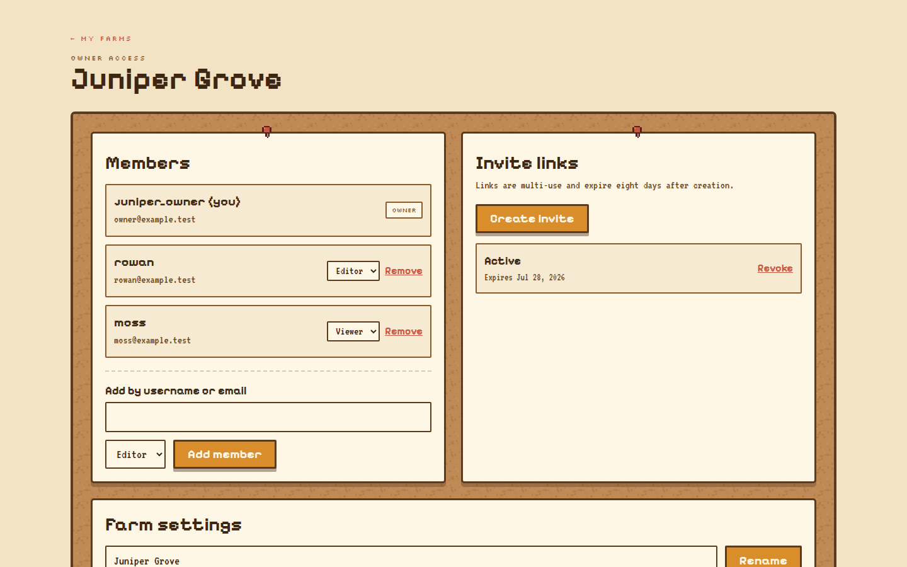
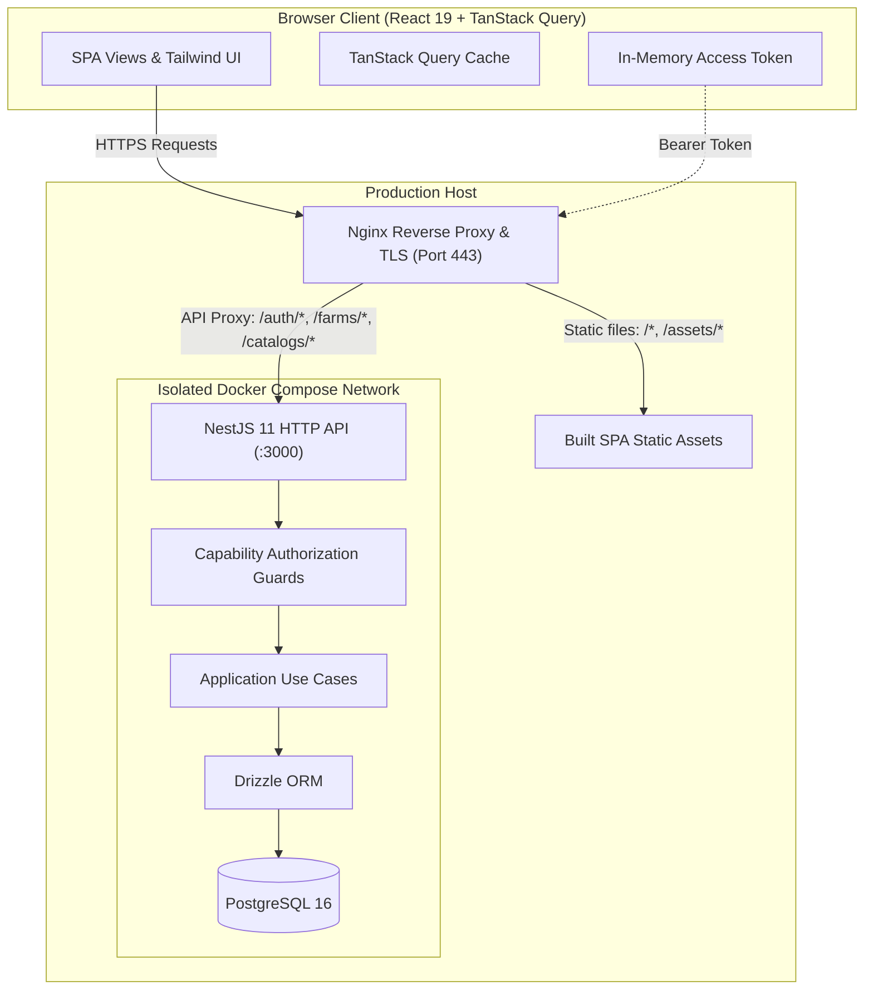

# Farm Bundle Tracker

<div align="center">

[](https://bundle-tracker.com)
[](https://github.com/LaithAlnajjar/farm-bundle-tracker/actions)
[](https://www.typescriptlang.org/)
[](https://react.dev/)
[](https://nestjs.com/)
[](https://www.postgresql.org/)
[](https://www.docker.com/)

**A shared, real-time planning board for multiplayer Stardew Valley farms.**

[**Explore Live Production App → https://bundle-tracker.com**](https://bundle-tracker.com)

</div>

---

## Overview

**Farm Bundle Tracker** replaces chaotic chat messages and outdated spreadsheets with a unified, real-time collaboration board for friends playing Stardew Valley together. It tracks Community Center room restoration, seasonal bundle item availability, claiming responsibilities, and completion milestones.

Beyond gameplay utility, this project is a production-grade full-stack reference system featuring:
- **Clean Architecture & Repository Ports:** Strict domain separation, use-case orchestration, and swappable persistence adapters.
- **Enterprise-Grade Authentication:** Short-lived in-memory access tokens paired with rotating hashed refresh tokens in `HttpOnly`, `SameSite` cookies.
- **Capability-Based Access Control:** Zero resource-enumeration leaks (unauthorized farm access yields generic `404 Not Found`).
- **Transactional State Reconciliation:** Atomic collection operations that automatically release slot and bundle claims upon completion.
- **Production-Hardened Infrastructure:** Containerized API and PostgreSQL deployed behind an automated TLS-terminating Nginx reverse proxy.

---

## ⚡ Try It Live (30-Second Tour)

The application is deployed live in production at **[https://bundle-tracker.com](https://bundle-tracker.com)**.

1. **Instant Access:**
   - Click **[bundle-tracker.com](https://bundle-tracker.com)**.
   - Register any test account (e.g. `reviewer@example.com` / `reviewer1` / password `password123`) — no email verification required.
2. **Create or Join a Farm:**
   - Create your own farm in one click (e.g., *"Starfruit Acres"*).
   - Alternatively, join an existing farm via multi-use invite link.
3. **Experience the Tracker:**
   - **Overview Dashboard:** Check seasonal recommendations, current progress percentages, and urgent seasonal items.
   - **Rooms & Bundles:** Drill into the Pantry, Crafts Room, or Fish Tank to view required items and Stardew Valley 1.6.15 catalog data.
   - **Claim Tasks:** Claim items you plan to forage, fish, or grow. Notice how claims auto-release when items are marked collected!
   - **Team Management:** Invite friends as *Owner*, *Editor*, or *Viewer*, or generate shareable 8-day invite links.

---

## Application Showcase

<div align="center">



*Farm collaboration dashboard: configure roles, manage permissions, create expiring invite links, and coordinate shared bundles.*

</div>

### Key Product Views
- **Task-First Overview:** URL-addressable seasonal filters showing items needed right now in Spring, Summer, Fall, or Winter.
- **Room & Bundle Explorer:** Full Community Center catalog fidelity including quality-star requirements, alternate choice bundles (e.g., 6 of 12 options), and version rewards.
- **My Tasks:** Dedicated view of your active claims with one-click collection status toggling.
- **Member Management:** Capability-based role management with ownership transfer and revocable invite links.

---

## Shipped System Capabilities

| Domain | Shipped Production Capability | Architectural Boundary |
| --- | --- | --- |
| **Authentication & Sessions** | Open registration, secure login, rotating refresh tokens with reuse detection, atomic sign-out. | In-memory JWT access token, `HttpOnly` cookie for hashed refresh session. |
| **Farm Collaboration** | Full CRUD, role hierarchy (*Owner*, *Editor*, *Viewer*), direct member additions, ownership transfer. | Capability-driven guards; non-members receive generic `404` to prevent enumeration. |
| **Expiring Invites** | Cryptographically secure 8-day multi-use invite codes with immediate revocation and idempotent redemption. | Use-case orchestration with transactional membership binding. |
| **Catalog Engine** | Stardew Valley 1.6.15 reference catalog with provenance manifest, SHA checksums, and idempotent migration seeder. | Immutable catalog schema with slot-level metadata and image spritesheet assets. |
| **Bundle Tracking** | Version-bound farm state, active season switching, item collection toggles, personal task claims. | Relational integrity in PostgreSQL 16; atomic claim release on collection. |
| **Live Sync** | 15-second adaptive polling with automatic window focus refetch and optimistic cache updates. | TanStack Query cache synchronization with server-authoritative reconciliation. |
| **Production Delivery** | Containerized deployment, systemd process supervision, Nginx reverse proxy, Certbot SSL. | Multi-stage Docker builds, isolated internal Docker network, zero exposed DB ports. |

---

## Architecture at a Glance



### Engineering Highlights

- **Feature-First Client Architecture:** Code is organized by product slice (`features/farms`, `features/catalogs`, `features/auth`), ensuring UI, state, and API contracts evolve together without global coupling.
- **Hexagonal Backend Core:** Strict layering (`presentation` → `application` → `domain` ← `infrastructure`). Application use cases depend solely on domain interfaces (repository ports); Drizzle ORM and NestJS controllers sit at the boundary.
- **Defensive Session Rotation:** Refresh tokens are hashed before storage. If a compromised refresh token is replayed, the backend detects session reuse and invalidates the entire token family.
- **Deterministic Data Invariants:** Claims and collections are bound by transactional constraints. Completing a choice bundle (e.g. 5 of 6 slots) automatically cleans up remaining dangling claims across the group.
- **Hardened Production Profile:** Production containers run under an unprivileged `node` user with `no-new-privileges:true`. Database ports are unreachable from the public internet.

---

## Tech Stack

| Layer | Technologies |
| --- | --- |
| **Web Client** | React 19, TypeScript 5.7+, Vite 8, React Router 8, TanStack Query 5, Tailwind CSS 4, Radix UI |
| **Backend API** | NestJS 11, Node.js 24, TypeScript, class-validator, class-transformer |
| **Database & ORM** | PostgreSQL 16, Drizzle ORM, Drizzle Kit |
| **Security & Auth** | JSON Web Tokens (HMAC-SHA256), bcrypt password hashing, HTTP-only SameSite cookies |
| **Production Infrastructure** | Linux, Docker Compose, Nginx, Let's Encrypt / Certbot |
| **Developer Experience** | npm workspaces, ESLint 9/10 (flat config), Prettier, Jest, GitHub Actions CI |

---

## Developer Experience & Monorepo Tooling

### Prerequisites
- **Node.js 24+**
- **Docker Engine & Docker Compose v2**

### Unified Workspace Commands

Run all routine commands directly from the monorepo root:

| Command | Purpose |
| --- | --- |
| `npm run build` | Compiles both backend NestJS distribution and frontend Vite SPA |
| `npm run lint` | Runs ESLint with autofix across all packages |
| `npm run lint:check` | Strict ESLint validation across all packages (used in CI) |
| `npm run typecheck` | Comprehensive TypeScript verification (`tsc --noEmit` & `tsc -b`) |
| `npm test` | Runs Jest unit and domain test suites across workspaces |
| `npm run db:up` | Boots local PostgreSQL 16 container via Docker Compose |
| `npm run db:down` | Stops local PostgreSQL container |
| `npm run db:reset` | Resets local database volume for a clean state |
| `npm run dev:backend` | Starts NestJS API with live watch reload (`http://localhost:3000`) |
| `npm run dev:frontend` | Starts Vite dev server with hot module replacement (`http://localhost:5173`) |

### Local Quickstart

```bash
# 1. Install all dependencies across workspaces
npm install

# 2. Configure local environment variables
cp .env.example .env

# 3. Spin up PostgreSQL and apply schema migrations
npm run db:up
npm run db:migrate -w backend

# 4. Seed the Community Center 1.6.15 catalog
npm run db:seed:catalog -w backend

# 5. Launch development services
npm run dev:backend   # Terminal 1 (API on :3000)
npm run dev:frontend  # Terminal 2 (Client on :5173)
```

Frontend will be available at [http://localhost:5173](http://localhost:5173) and API at [http://localhost:3000](http://localhost:3000).

---

## CI/CD Pipeline

Continuous integration runs on every pull request and push to `main` via [GitHub Actions](.github/workflows/ci.yml):
- **Dependencies:** Reproducible clean install via `npm ci` on Node.js 24.
- **Code Quality:** Workspace-wide lint check (`npm run lint:check`).
- **Type Safety:** Full TypeScript typecheck across backend and frontend (`npm run typecheck`).
- **Test Verification:** Unit and application test suites executed (`npm test`).
- **Build Verification:** Production bundling for both services (`npm run build`).

---

## Documentation Handbook

Comprehensive engineering documentation is available in [`docs/`](./docs/):

- **[Documentation Handbook](./docs/README.md)** — Master index and reading guide.
- **[Architecture Decisions Log (ADRs)](./docs/decisions.md)** — Context, tradeoffs, and consequences for major technical choices.
- **[System Architecture Overview](./docs/architecture/overview.md)** — System boundaries, data flow, and state ownership.
- **[Frontend Architecture](./docs/architecture/frontend.md)** — Feature-first structure, cache strategy, and component composition.
- **[Backend Architecture](./docs/architecture/backend.md)** — Clean Architecture layers, ports, adapters, and request lifecycle.
- **[Data Architecture & Invariants](./docs/architecture/data.md)** — Schema definitions, transactional boundaries, and catalog versioning.
- **[HTTP API Specification](./docs/reference/api.md)** — Route endpoints, request/response DTOs, and error conventions.
- **[Local Development & Troubleshooting](./docs/development/setup.md)** — Detailed environment reference and database commands.
- **[Testing Strategy](./docs/development/testing.md)** — Test pyramid, fakes, and verification criteria.
- **[Contributing Guidelines](./CONTRIBUTING.md)** — Branching, commit conventions, and definition of done.

---

## License

This project is licensed under the MIT License.
