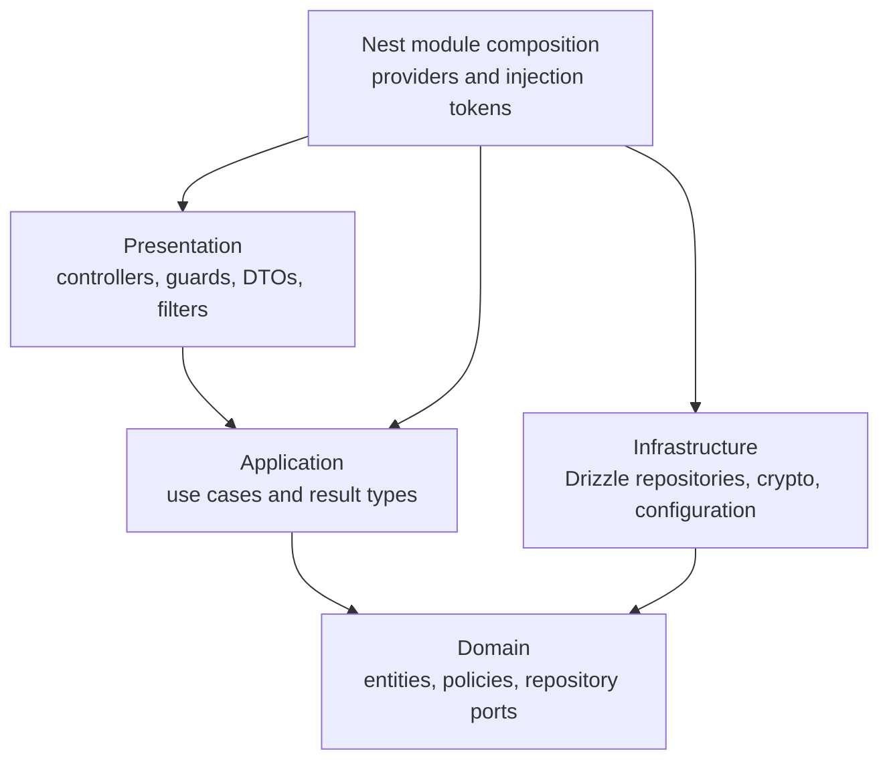

# Backend architecture

The backend is a modular NestJS application organized around product domains.
Its layering keeps HTTP and Drizzle details at the edges while application
use cases express the work the system performs.

## Modules and responsibilities

| Module | Responsibility | Current shape |
| --- | --- | --- |
| `auth` | Sign-in, access-token verification, refresh rotation, logout, current session | Domain, application, infrastructure, presentation |
| `users` | User entity and persistence contract used by auth and farms | Domain and infrastructure, composed through `UsersModule` |
| `farms` | Farm lifecycle, board state, claims, memberships, roles, invitations, authorization | Domain, application, infrastructure, presentation |
| `catalogs` | Versioned Community Center reference data | Read layers, Drizzle schema, guarded seed infrastructure |

`AppModule` composes these modules and the shared `DrizzleModule`. Application
behavior crosses a module boundary through an exported contract. An
infrastructure read adapter may join another module's schema when assembling a
module-owned projection—as the farms adapter does for member usernames and
emails—but it must not mutate the other module's records. The catalogs module
exports its read repository contract; catalog writes remain seed-only.

## Dependency direction

Dependencies point toward policy. Domain code does not import NestJS, Drizzle,
controllers, or persistence schemas. Infrastructure imports domain contracts
because it implements them. Nest modules and injection tokens connect concrete
adapters to use cases without turning those tokens into domain concepts.

Some existing application classes throw Nest HTTP exceptions. New domain rules
should still prefer explicit domain errors and translate them at the
presentation edge; this keeps reusable policy independent of transport while
allowing the current code to evolve incrementally.

## Layer responsibilities

### Domain

The domain owns entities and value-bearing behavior, repository interfaces,
service interfaces, and policies that can run without Nest or PostgreSQL.
Examples include refresh-token state, invite activity, and the farm capability
matrix.

Domain repositories describe operations in product language. They return
entities or domain-facing results, not Drizzle rows or HTTP DTOs.

### Application

A use case coordinates one user intent. It validates workflow rules, invokes
domain behavior, authorizes farm actions, and calls repository or service
ports. Use cases do not parse requests, set cookies, or construct SQL.

Cross-cutting farm authorization is centralized in
`AuthorizeFarmActionUseCase`. The caller supplies a capability such as `view`,
`manage-members`, or `delete`; the use case loads membership and evaluates the
domain policy.

### Infrastructure

Infrastructure contains details that can change without changing the product
language: Drizzle queries, PostgreSQL transactions, bcrypt, JWT signing,
cryptographic token generation, hashing, and environment-backed configuration.

Repository adapters are responsible for translating database rows into domain
objects. Multi-write invariants such as ownership transfer and invite
redemption use transactions in this layer.

### Presentation

Controllers own paths, HTTP methods, parameter parsing, request DTOs, response
mapping, cookies, and status codes. The global validation pipe strips unknown
properties and rejects requests containing non-whitelisted fields.

The global authentication guard protects every route unless a controller or
handler has the `@Public()` marker. The guard and domain exception filter map
authentication failures to stable `401` responses; ordinary Nest exceptions
retain Nest's JSON error shape.

## Worked request: update a member role

`PATCH /farms/:farmId/members/:membershipId` demonstrates the boundary flow:

1. `AuthGuard` verifies the access token and attaches the authenticated user.
2. `FarmMembersController` parses both integer identifiers and validates the
   requested role DTO.
3. `UpdateFarmMemberRoleUseCase` authorizes `manage-members` for the actor.
4. The use case prevents invalid self/owner transitions and chooses either a
   normal role update or ownership transfer.
5. `FarmCollaborationRepository` expresses the required operation; the
   Drizzle adapter performs it, using a transaction for ownership transfer.
6. The controller maps the returned membership to `FarmMemberResponseDto`.

Board mutations follow the same pattern and serialize writes on the farm row.
Collection may release several claims when an N-of-M bundle crosses its
threshold, so each mutation returns a newly assembled authoritative board.

## Authentication and authorization

Authentication answers who is calling. A short-lived JWT access token travels
in the `Authorization: Bearer` header. A longer-lived opaque refresh token is
hashed in PostgreSQL and travels in an HTTP-only cookie scoped to `/auth` by
default. Refresh rotates both tokens; presenting a known replaced token revokes
the affected session chain.

Authorization answers what that user may do to one farm. Capabilities are
mapped from owner, editor, and viewer roles in a pure domain policy. A missing
membership produces `404`, preventing farm enumeration. A known member without
the requested capability receives `403`.

See the [API contract](../reference/api.md) for route-level requirements.

## Adding backend behavior

1. Name the user intent and place orchestration in one module-owned application
   use case.
2. Put business invariants in an entity or domain policy when they can be
   expressed without I/O.
3. Extend a narrow domain port if persistence or an external service is needed.
4. Implement the port under infrastructure and bind it in the Nest module.
5. Add presentation DTOs and a controller handler that only translate HTTP.
6. Test domain rules directly; test use-case orchestration with port fakes; add
   real HTTP/database coverage for contracts, permissions, and transactions.

Avoid generic `services` that combine controllers, business rules, and queries.
Do not expose ORM rows beyond infrastructure or reach into another module's
internal folders when an exported contract is required.
