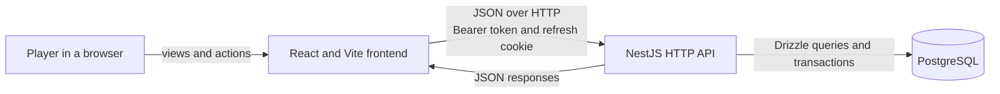

# Architecture overview

Farm Bundle Tracker is a browser application backed by one HTTP API and one
PostgreSQL database. The repository is an npm-workspace monorepo, but the two
applications remain independently buildable and communicate only through the
HTTP contract.

## System boundaries

Only PostgreSQL runs in Docker during local development. The frontend and API
run as host processes, which is why `DATABASE_URL` uses `localhost` rather than
the Compose service name.

The frontend owns rendering, navigation, session hydration, form interaction,
and remote-state caching. The backend is the authority for identity,
authorization, farm membership, invite lifecycle, and catalog persistence.
PostgreSQL owns relational invariants and durable state.

## A request through the system

An authenticated farm request follows one consistent path:

1. A feature hook asks a feature service to call the shared API client.
2. The API client attaches the in-memory access token and includes credentials.
3. The global backend guard verifies the bearer token unless the route is
   explicitly public.
4. The controller parses transport input and calls an application use case.
5. Farm-scoped use cases authorize the requested capability against membership.
6. A repository port is fulfilled by a Drizzle adapter, which reads or writes
   PostgreSQL.
7. The controller maps the result to a response DTO; the feature hook updates
   or invalidates the relevant React Query cache.

If an authenticated frontend request receives `401`, the API client makes one
coordinated refresh attempt and retries the original request once. Refresh
failure clears the access token instead of entering a retry loop.

## Ownership by area

| Area | Frontend owner | Backend owner | Durable data |
| --- | --- | --- | --- |
| Accounts and sessions | `features/auth` | `modules/auth`, `modules/users` | users, refresh tokens |
| Farm lifecycle and access | `features/farms` | `modules/farms` | farms, memberships, invites |
| Marketing pages | `features/marketing` | None | None |
| Community Center catalog | Board UI not implemented | `modules/catalogs` seed infrastructure | versions, rooms, bundles, items, slots |
| Bundle progress and claims | Planned farm-board feature | Planned farm collaboration domain | Planned per-farm state |

The catalogs module currently contains schema and seed infrastructure rather
than the full set of application and presentation layers. Those layers should
appear when the read-only catalog API is implemented; empty abstractions are
not added merely to make every module look symmetrical.

## Current implementation

The working HTTP product supports accounts, rotating sessions, farm creation
and management, role-based membership, direct member addition, ownership
transfer, and expiring multi-use invite links. The full standard Community
Center catalog can be validated and seeded, but it is not exposed through an
API or rendered as a working board yet.

Synchronization is request/refetch based. The local Compose topology provides
PostgreSQL only. Production containers, a reverse proxy, TLS, backups,
continuous delivery, and persistent push connections are not present.

## Direction

The next product slice exposes the catalog and adds per-farm collection and
claim state. After the tracker is useful over ordinary HTTP, the roadmap adds a
production topology and an authenticated, farm-scoped push channel with
reconnect and resynchronization semantics.

Those additions should preserve the current ownership rules:

- HTTP and real-time entry points reuse the same farm authorization policy.
- Derived bundle, room, and farm progress is computed from slot state rather
  than stored as editable truth.
- The browser continues to treat the server as the authority and uses its query
  cache as a synchronized projection, not an independent data store.
- Deployment documentation is written from the delivered topology, not from a
  speculative design.

Continue with the [frontend](./frontend.md), [backend](./backend.md), or
[data](./data.md) architecture guide. The [API contract](../reference/api.md)
describes the implemented HTTP surface.
